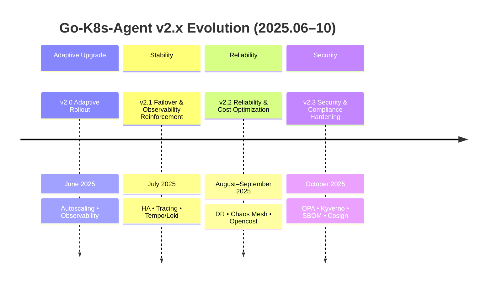

# go-k8s-agent
>  Go-based Kubernetes Agent  
> Kubernetes Node/Cluster Telemetry를 수집/노출하는 Go 기반 K8s Agent를 만듭니다. 
> Prometheus Exporter + Grafana Dashboard 세트로 시작하여, Stability/Failover, Reliability & Cost Optimization, Security & Compliance 까지 단계별로 진행 중입니다. 

---

## 2025 Timeline


---

### Version Highlights
- **v2.0 (Metrics Foundations)**: node/cluster metrics 수집기 초판 구현함, `pkg/collector`, `pkg/exporter` 구조로 역할 분리.  
- **v2.1 (Stability Focus)**: `CrashLoopBackOff`/drain 시나리오 대응, startup/shutdown 시그널링 개선, rollout 안정성 강화.  
- **v2.2 (Reliability & Cost)**: `Opencost` 연동 가이드 제공함, DR 테스트(chaos 시나리오) 및 리소스 프로파일링 기반 최적화.  
- **v2.3 (Security & Compliance)**: `OPA/Kyverno` 정책 샘플, `SBOM` 생성 및 `cosign` 서명 체계 연동 가이드 개선.

### Scope
- Collector: Node/Pod/Resource 지표 수집 컴포넌트.  
- Exporter: `Prometheus` scrape endpoint .  
- Dashboards: 운영 관점의 SLI 중심 패널 .  
- Reliability: Failover/Failback 핸드북 및 chaos 테스트 가이드 .  
- Cost: CPU/Memory/IO profile 기반 request/limit 최적화 워크플로  
- Security: Policy-as-Code(`OPA/Kyverno`)와 Supply-chain(`SBOM/cosign`) 연계 가이드 포함.

### How to run (local)
```bash
# build & run
go build -o bin/agent ./cmd/agent && ./bin/agent

# metrics
curl -sf localhost:9100/metrics | head

# dashboard (optional)
docker compose up -d prometheus grafana
```

### Validation
- Exporter up/target 상태가 Prometheus에서 green 인지 확인  
- Dashboard 패널(SLI/Error budget/Resource heatmap)이 의도대로 표기되는지 확인.  
- Chaos 테스트 시나리오에서 alert → triage → rollback 플로우가 재현되는지 확인.  
- SBOM 생성 및 이미지 서명/검증 플로우가 CI 단계에서 통과되는지 확인.

### Risk & Mitigation
- Kubernetes 버전별 API 차이로 collector 일부 경로가 달라질 수 있음 → feature gate/빌드 태그로 분기.  
- 정책/서명 도구 설치 유무에 따라 문서형(noop) 단계가 존재함 → `confirm/DRY_RUN` 가드로 안전성 확보.

### Next
- `NodeProblemDetector`/`Kube-state-metrics` 와의 중복 영역 조정 및 보완할 예정입니다. .  
- Agent 자체 메트릭(`process_*`, exporter internal) 추가해 self-observability 강화 예정...
